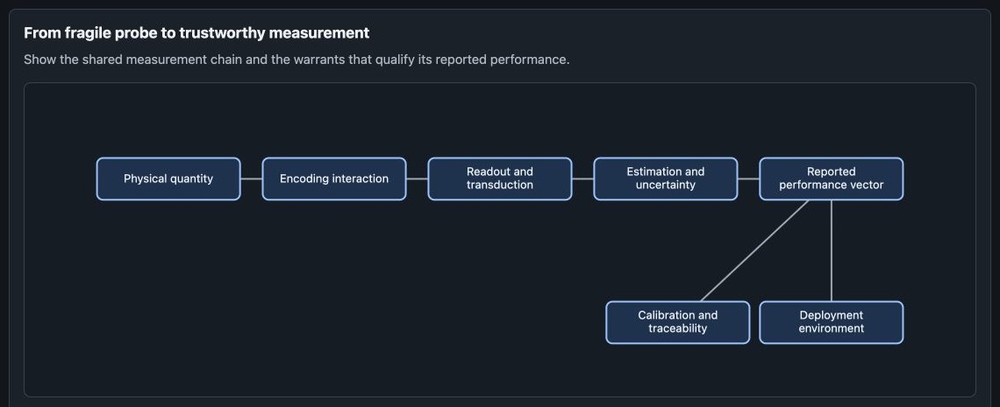

# Structure of Knowledge (SoK)

Structure of Knowledge, or SoK, is a Codex skill and orchestration harness for turning an unfamiliar field into a reusable knowledge scaffold: field structure, source layers, evidence standards, visual maps, and next-step task plans.

SoK was originally developed for research-oriented field mapping. Its more general role is to produce a structured intermediate artifact that other agents, research systems, writing tools, curriculum tools, or visualization layers can adapt for many audiences and formats.

The core scaffold idea is inspired by pedagogical ideas of Jerome Bruner and the structure-of-knowledge curriculum tradition: decompose a domain into the concepts, representations, methods, and warrants that make it intelligible, then recompose that structure into a scaffold for learning, research, and downstream generation.



This current-version example organizes quantum sensing around its measurement chain and places the validated field-element map inside the relevant section.

## What SoK Does

SoK helps an agent:

- review how a field defines its boundary and warrants claims;
- identify its actual questions, objects, cases, representations, methods, institutions, instruments, data, and disputes;
- separate core ideas from the surrounding elements needed to understand them;
- compare possible organizing forms before choosing a report structure;
- connect sources, claims, relations, curricula, and visual views in a validated JSON artifact.

The generated scaffold is a discovery canvas, not a report template. The final report chooses its own thesis, section order, and visual logic after source review.

## Installation

The macOS/Linux installer requires Rust with Cargo, `curl`, and `tar`. It downloads the selected Git revision, builds the CLI locally, and installs the skill to `${CODEX_HOME:-$HOME/.codex}/skills/structure-of-knowledge`.

```bash
curl -fsSL https://raw.githubusercontent.com/perhyper/SoK/main/install.sh | sh
```

To test a branch, tag, or commit:

```bash
REF=your-branch
curl -fsSL https://raw.githubusercontent.com/perhyper/SoK/main/install.sh |
  sh -s -- --ref "$REF"
```

Rerun the installer to update. Windows automated installation is not yet supported.

```bash
SOK_CLI="${CODEX_HOME:-$HOME/.codex}/skills/structure-of-knowledge/bin/sok"
"$SOK_CLI" --version
"$SOK_CLI" --help
```

## Use the Skill

In Codex:

```text
Use $structure-of-knowledge to map computational neuroscience into a reusable field scaffold with sources, visual maps, and next-step tasks.
```

From a repository checkout:

```bash
cargo run --locked --manifest-path cli/Cargo.toml --bin sok -- scaffold \
  --field "computational neuroscience" \
  --learner "technical reader new to neuroscience" \
  --goal "build a reusable field map" \
  --weeks 12 \
  --output /tmp/sok-scaffold.md
```

The scaffold guides source review, field-element extraction, organizing-form comparison, and a final report-architecture decision. `handoff-report` packages that working context for another agent without exposing it in the public report.

## Validated Report Workflow

Each run is bounded to its Markdown, source manifest, and reviewed evidence. It creates no persistent database or cross-run evidence store.

```bash
REPORT=/path/to/report.md
SOURCES=/path/to/sources.csv
EVIDENCE=/path/to/reviewed-evidence.jsonl

cli/target/release/sok lint \
  --stage final --report "$REPORT" --sources "$SOURCES" \
  --evidence "$EVIDENCE" --strict
cli/target/release/sok export-json \
  --stage final --report "$REPORT" --sources "$SOURCES" \
  --evidence "$EVIDENCE" --output /tmp/sok-report.json
cli/target/release/sok validate-report \
  --input /tmp/sok-report.json --strict
cli/target/release/sok render-html \
  --input /tmp/sok-report.json --output /tmp/sok-report.html
```

Public `##` sections are preserved in their authored order. Structured tables can keep their canonical headings or use `<!-- sok:surface ... -->` markers, so validation does not dictate the table of contents. Relation-backed views can be placed in a section with `<!-- sok:visual-view view-id -->`.

`sok-report.json` is the structured source of truth: `field_elements` preserves field-native classes, while HTML is a self-contained public view rendered only from validated `human_report` JSON.

## CLI

```text
init              Create an agent workspace.
brief             Generate an agent handoff brief.
scaffold          Generate a field-discovery and report-architecture canvas.
handoff-report    Prepare a scaffold for human-report completion.
source-template   Create a source manifest template.
audit-sources     Audit access metadata.
download-sources  Download explicitly open or user-provided sources.
ingest last       Normalize source metadata into bounded evidence JSONL.
lint              Check Markdown, sources, and evidence before export.
export-json       Export bounded inputs to sok-report.json.
validate-report   Validate evidence, currentness, relations, and references.
render-html       Render validated human_report JSON to local HTML.
specificity       Make an underspecified domain task executable.
```

Run `sok <command> --help` for flags.

## Source Access

Downloads are conservative. By default, only `open_access`, `free_web`, `public_domain`, `cc_by`, `cc_by_sa`, `official_open`, and `user_provided` sources are downloaded. Paid, paywalled, subscription-only, restricted, unknown, and blank statuses remain metadata-only unless an explicit flag permits the attempt; flags never grant legal access.

## Development

The portable skill lives in `structure-of-knowledge/`; the Rust crate lives in `cli/`. Build output is not tracked.

```bash
make test
make vet
make test-install
make build
```

The implementation-neutral contracts are in `specs/`, and detailed research and output rules are in `structure-of-knowledge/references/`.

## License

MIT License. See `LICENSE`.
