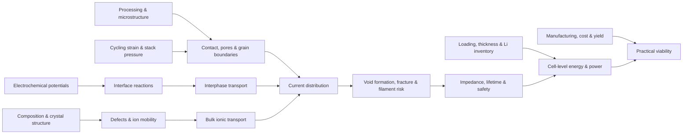

# Structure of Knowledge: Solid-State Batteries

Evidence reviewed through 2026-07-25. Scope: rechargeable lithium all-solid-state cells, with liquid and semi-solid systems used only as comparison points.

## Domain Decomposition

Solid-state batteries are an emerging, interdisciplinary, instrument-bound, and infrastructure-bound field. Its organizing problem is not “find the best solid electrolyte.” It is: **move lithium ions quickly while blocking electrons, preserving chemically compatible and mechanically continuous interfaces, and doing so in a thin, high-loading cell that can be manufactured and cycled under practical pressure and temperature.**

The field is best read as five coupled layers:

1. **Bulk transport:** crystal chemistry, defects, phase stability, grain boundaries, ionic and electronic conductivity.
2. **Interfacial thermodynamics and kinetics:** electrochemical stability, reaction products, passivation, charge transfer, and space-charge effects.
3. **Chemo-mechanics:** contact loss, voids, local flux concentration, fracture, filament penetration, particle expansion, and stack pressure.
4. **Cell architecture:** electrolyte thickness, cathode loading, areal capacity, negative-to-positive capacity balance, pressure, temperature, rate, and lifetime.
5. **Manufacturing and validation:** powder handling, densification, coatings, sheet and pouch processing, reproducibility, safety qualification, cost, and yield.

The layers form a constraint network: improving one variable can worsen another. A softer electrolyte may improve contact but narrow a processing or stability window; more pressure may suppress voids but increase hardware mass or mechanical damage; a highly conductive phase may react at an electrode and create a resistive interphase.

## Orientation

The field’s historical arc explains its structure. The 2011 LGPS result made liquid-like room-temperature ionic conductivity plausible in a crystalline solid. Later work showed that conductivity is only one gate: buried interfaces, contact mechanics, composite-electrode transport, pressure, and manufacturing determine whether a material result becomes a useful cell.

Three distinctions prevent most beginner errors:

- **Solid electrolyte is not the same as solid-state battery.** A conductivity record is a material property; a battery claim concerns an integrated cell.
- **Stable does not mean inert.** A useful interface may form a thin passivating interphase, while an apparently wide electrochemical window may hide slow decomposition.
- **Dendrite is an incomplete explanation.** In solids, void formation, local flux constriction, defects, crack initiation, lithium penetration, and pressure are coupled parts of the failure mechanism.

A credible paper therefore reports not only capacity retention, but also loading, areal capacity, electrolyte thickness, cell geometry, pressure during assembly and cycling, temperature, rate definition, lithium inventory, replicate count, and failure criterion.

## Deep Structure

| Element | In this field | Sources |
|---|---|---|
| Core objects | Solid-electrolyte phases; mobile ions and defects; electrodes; interfaces and interphases; grains and pores; composite electrodes; separators; electron-collecting foils; cell fixtures. | Fundamentals of inorganic solid-state electrolytes for batteries; Interfaces and Interphases in All-Solid-State Batteries with Inorganic Solid Electrolytes |
| Generative relation | Composition and structure set defect populations and migration barriers; processing sets microstructure and contact; cycling changes chemistry and stress; those changes reshape local transport and reaction rates. | Fundamentals of inorganic solid-state electrolytes for batteries; Characterizing Electrode Materials and Interfaces in Solid-State Batteries |
| Methods and warrants | Impedance spectroscopy warrants conductivity only with geometry temperature density blocking-electrode and fitting details; stability claims need chemical analysis; mechanism claims need spatially or chemically resolved observations plus controls; cell claims need complete operating conditions and replicates. | How Certain Are the Reported Ionic Conductivities of Thiophosphate-Based Solid Electrolytes?; Benchmarking the reproducibility of all-solid-state battery cell performance |
| Representations | Arrhenius plots; Nyquist and distribution-of-relaxation-time plots; chemical-potential diagrams; phase and stability maps; cross-sectional and tomographic images; pressure-capacity maps; mass and energy budgets; process-flow diagrams. | Characterizing Electrode Materials and Interfaces in Solid-State Batteries; Solid-State Battery Roadmap 2035+ |
| Threshold concepts | High bulk conductivity is necessary but insufficient; interphases can be functional or blocking; stripping can prepare a later plating short by creating voids; pressure is part of the electrochemical system; practical performance is areal and cell-level rather than a single gravimetric number. | Interfaces and Interphases in All-Solid-State Batteries with Inorganic Solid Electrolytes; Critical stripping current leads to dendrite formation on plating in lithium anode solid electrolyte cells (2019-07-29); Benchmarking the performance of all-solid-state lithium batteries |
| Failure modes | Optimizing one property in isolation; importing liquid-electrolyte intuition unchanged; calling every short a dendrite; comparing cells with unmatched loading thickness pressure or temperature; extrapolating a press-cell result directly to manufacturing readiness. | Challenges in speeding up solid-state battery development; The critical importance of stack pressure in batteries |

## Source Role Probe

| Source role | Status | Candidate source pattern | What it tests | Waiver or revision rule |
|---|---|---|---|---|
| Foundation | Required | Solid-electrolyte fundamentals plus a canonical conductor paper | Whether the scaffold explains transport and material families before device claims | Cannot be waived |
| Method | Required | Interlaboratory study or measurement-focused review | Whether reported quantities have a reproducible warrant | Cannot be waived |
| Representation | Required | Operando or multimodal characterization synthesis | Whether diagrams and images correspond to observable mechanisms | Cannot be waived |
| Synthesis | Required | Cross-layer review of interfaces mechanics and cell design | Whether the field is organized beyond a material list | Cannot be waived |
| Frontier | Required | Dated 2025-01-01 or later review and research article | Whether open problems are separated from durable foundations | Replace when evidence review is renewed |
| Infrastructure | Required | Official manufacturing or technology roadmap | Whether scale-up constraints appear as part of the knowledge structure | Cannot be replaced by a company announcement |
| Curriculum | Required | Open electrochemical-energy course | Whether prerequisites and learning order are explicit | Cannot be waived |

## Literature Ladder

| Layer | Start here | Read for | Do not infer |
|---|---|---|---|
| Prerequisite | MIT 10.626 Electrochemical Energy Systems | Galvanic-cell physics impedance thermodynamics and battery models | Solid-state-specific interface mechanisms |
| Canonical case | A lithium superionic conductor | How a high-conductivity sulfide changed the feasible design space | That high conductivity alone yields a practical cell |
| Foundation | Fundamentals of inorganic solid-state electrolytes for batteries | Transport families electrochemical behavior mechanics and processing | A ranking that is independent of cell architecture |
| Interface synthesis | Interfaces and Interphases in All-Solid-State Batteries with Inorganic Solid Electrolytes | Contact reaction products and interphase transport | That “no reaction” is the only route to stability |
| Measurement warrant | How Certain Are the Reported Ionic Conductivities of Thiophosphate-Based Solid Electrolytes? | How much EIS-derived conductivity varies across laboratories | That a single reported decimal is a portable material constant |
| Mechanism cases | Critical stripping current leads to dendrite formation on plating in lithium anode solid electrolyte cells (2019-07-29); Visualizing plating-induced cracking in lithium-anode solid-electrolyte cells | The void-flux-fracture chain and the evidence needed to see it | That all shorts share one mechanism |
| Cell benchmark | Benchmarking the performance of all-solid-state lithium batteries; Benchmarking the reproducibility of all-solid-state battery cell performance | Practical metrics reporting variables and protocol sensitivity | That capacity retention is comparable without matched conditions |
| Translation | Solid-State Battery Roadmap 2035+; Challenges in speeding up solid-state battery development | Manufacturing pathways component choices and commercialization gates | That a forecast is mechanistic evidence |
| Dated edge | The critical importance of stack pressure in batteries; Mechanically compliant and cost-effective solid electrolyte for all-solid-state batteries; Interfaces in All-Solid-State Li Metal Batteries: From Fundamental Research to Practical Applications | The 2025-08-13 to 2026-06-29 emphasis on low pressure compliance cost and application-facing interfaces | That a single recent material closes the translation gap |

## Curriculum Roadmap

| Phase | Module | Essential question | Readings | Practice artifact | Progress criteria |
|---|---|---|---|---|---|
| 1 | Electrochemical grammar | What fixes voltage electron flow transport and polarization in a cell? | MIT 10.626 Electrochemical Energy Systems | Annotated galvanic-cell and equivalent-circuit model | Derive the role of chemical potential and distinguish ohmic charge-transfer and diffusion losses |
| 2 | Defects and ion transport | How do composition structure disorder and temperature produce ionic conductivity? | Fundamentals of inorganic solid-state electrolytes for batteries; A lithium superionic conductor | Conductivity mechanism map and Arrhenius critique | Connect carrier concentration and mobility to an experiment without treating a fitted value as mechanism |
| 3 | Electrolyte families | Why do sulfides oxides halides polymers and composites occupy different design regions? | Fundamentals of inorganic solid-state electrolytes for batteries | Family trade-off matrix | Compare transport stability mechanics processing and cost without naming a universal winner |
| 4 | Stability and interphases | When does decomposition passivate and when does it block transport? | Interfaces and Interphases in All-Solid-State Batteries with Inorganic Solid Electrolytes | Chemical-potential and interphase causal diagram | Distinguish thermodynamic stability kinetic stability and functional passivation |
| 5 | Lithium contact and fracture | How do stripping plating voids pressure defects and cracks interact? | Critical stripping current leads to dendrite formation on plating in lithium anode solid electrolyte cells (2019-07-29); Visualizing plating-induced cracking in lithium-anode solid-electrolyte cells | Failure-chain diagram with competing hypotheses | Propose an observation that discriminates local flux concentration from a purely bulk-strength explanation |
| 6 | Composite cathodes | How do ionic electronic and mechanical networks coexist in a high-loading electrode? | Characterizing Electrode Materials and Interfaces in Solid-State Batteries | Three-network composite sketch and bottleneck diagnosis | Identify transport length scales interfacial area and expansion-induced contact changes |
| 7 | Measurement and imaging | What does each instrument actually warrant? | How Certain Are the Reported Ionic Conductivities of Thiophosphate-Based Solid Electrolytes?; Characterizing Electrode Materials and Interfaces in Solid-State Batteries | EIS reporting sheet plus operando-method selection memo | State geometry resolution controls uncertainty and alternative explanations |
| 8 | Cell-level benchmarking | Which reported cell is genuinely closer to an application? | Benchmarking the performance of all-solid-state lithium batteries; Benchmarking the reproducibility of all-solid-state battery cell performance | Normalized comparison sheet for two papers | Recalculate or flag electrolyte thickness areal capacity pressure temperature inventory and replicate count |
| 9 | Manufacturing and scale-up | Which laboratory choices survive sheet processing pouch assembly cost and yield constraints? | Solid-State Battery Roadmap 2035+; Challenges in speeding up solid-state battery development | Material-to-cell process flow with failure gates | Separate a material milestone from a cell process and production milestone |
| 10 | Frontier paper audit | Does a 2026 material result move the coupled system or only one metric? | Mechanically compliant and cost-effective solid electrolyte for all-solid-state batteries; Interfaces in All-Solid-State Li Metal Batteries: From Fundamental Research to Practical Applications | Two-page claim-evidence-condition audit | Defend one supported conclusion identify one extrapolation and design the next discriminating experiment |

## Practice and Assessment

The capstone is a **claim-to-cell audit**, not a literature summary. Select one high-performance paper and reconstruct its evidence chain:

1. Rewrite the headline result as a conditional claim containing chemistry, geometry, loading, pressure, temperature, rate, cycle count, and failure criterion.
2. Draw the proposed causal mechanism and mark every edge as measured, inferred, simulated, or assumed.
3. Build a mass-and-thickness budget and identify which reported metric would change most in a pouch-format cell.
4. Name one control or operando observation that could falsify the favored mechanism.
5. Write a replication card containing all assembly and cycling variables required by another laboratory.

Passing work makes uncertainty visible, distinguishes material from cell evidence, and proposes a test that could change the conclusion.

## Frontier, Debates, and Open Problems

| Problem or debate | Current state | Why it matters | Key sources |
|---|---|---|---|
| Low-pressure operation | As of 2026-07-25, maintaining contact without heavy external compression remains a central translation problem; pressure can help contact yet also alter failure and hardware requirements. | A cell dependent on tens or hundreds of megapascals may not preserve its laboratory advantage at pack level. | The critical importance of stack pressure in batteries; Characterizing Electrode Materials and Interfaces in Solid-State Batteries |
| Interface design versus interface elimination | As of 2026-07-25, the useful target is often a controlled ion-conducting electron-blocking interphase rather than an impossible absence of reaction. | Interphase composition and morphology can dominate resistance lifetime and filament behavior. | Interfaces and Interphases in All-Solid-State Batteries with Inorganic Solid Electrolytes; Interfaces in All-Solid-State Li Metal Batteries: From Fundamental Research to Practical Applications |
| Reproducible cell assembly | As of 2026-07-25, shared materials still yield wide performance variation across laboratories because processing and fixture details differ. | Without replicates and complete protocols a record cell cannot become cumulative knowledge. | Benchmarking the reproducibility of all-solid-state battery cell performance; How Certain Are the Reported Ionic Conductivities of Thiophosphate-Based Solid Electrolytes? |
| Practical composite electrodes | As of 2026-07-25, high loading thin separators low inactive fraction and stable ionic-electronic-mechanical networks must be achieved together. | Optimizing dilute powder cells can conceal the transport and contact losses that appear at useful areal capacity. | Benchmarking the performance of all-solid-state lithium batteries; Solid-State Battery Roadmap 2035+ |
| Multi-objective electrolyte discovery | As of 2026-07-25, conductivity is being optimized jointly with compliance stability processability abundance and cost. | The best material is architecture-dependent and must be selected against a cell and manufacturing route. | Mechanically compliant and cost-effective solid electrolyte for all-solid-state batteries; Fundamentals of inorganic solid-state electrolytes for batteries |

## Concept Map

## Visual Summary

Read every result from left to right:

**material chemistry → measured transport → interface evolution → mechanical contact → cell conditions → manufacturing consequence**

If a paper skips a link, treat the downstream conclusion as an inference and ask what observation would test it.

## Sources and Further Reading

The accompanying `sources.csv` records identifiers, dates, access routes, source roles, and curricular use. The accompanying `reviewed-evidence.jsonl` records which claims were checked against which source locations. Publisher abstracts are treated as bounded evidence; they do not license inferences beyond the material visible at the recorded access route.

## Claims

| Statement | Claim type | Evidence requirement | Source IDs | Confidence | Temporal status | Notes |
|---|---|---|---|---|---|---|
| Solid-state battery research is a coupled bulk-interface-mechanics-cell-manufacturing problem rather than an electrolyte-conductivity ranking. | structural | multiple_reviewed_sources | Fundamentals of inorganic solid-state electrolytes for batteries; Challenges in speeding up solid-state battery development; Solid-State Battery Roadmap 2035+ | high | durable | Organizing thesis of this scaffold. |
| High room-temperature ionic conductivity is necessary for many cell concepts but does not by itself establish interface stability or practical cell performance. | structural | multiple_reviewed_sources | A lithium superionic conductor; Interfaces and Interphases in All-Solid-State Batteries with Inorganic Solid Electrolytes; Benchmarking the performance of all-solid-state lithium batteries | high | durable | Separates a material milestone from a device claim. |
| Impedance-derived ionic conductivity requires explicit geometry temperature density contact fitting and replication metadata before values can be compared across laboratories. | methodological | reviewed_source | How Certain Are the Reported Ionic Conductivities of Thiophosphate-Based Solid Electrolytes? | high | durable | The cited round robin quantifies substantial interlaboratory spread. |
| Lithium stripping can create interfacial voids that concentrate later plating flux and contribute to cracking penetration and short circuit. | structural | multiple_reviewed_sources | Critical stripping current leads to dendrite formation on plating in lithium anode solid electrolyte cells (2019-07-29); Visualizing plating-induced cracking in lithium-anode solid-electrolyte cells | high | durable | Mechanism is conditional on cell materials defects and operating conditions. |
| Capacity retention is not a portable performance metric unless electrolyte thickness loading areal capacity lithium inventory pressure temperature rate and cell geometry are reported. | methodological | multiple_reviewed_sources | Benchmarking the performance of all-solid-state lithium batteries; Benchmarking the reproducibility of all-solid-state battery cell performance; Characterizing Electrode Materials and Interfaces in Solid-State Batteries | high | durable | A comparison rule rather than a universal performance threshold. |
| A 21-group study found large variability under shared materials and electrochemical protocol and recommended fuller parameter reporting plus triplicate data. | currentness | reviewed_source | Benchmarking the reproducibility of all-solid-state battery cell performance | high | current | Evidence dated 2024-09-18 and reviewed 2026-07-25. |
| Stack pressure is a coupled electrochemical and mechanical control variable with both beneficial and harmful regimes rather than a universally beneficial setting. | structural | multiple_reviewed_sources | The critical importance of stack pressure in batteries; Characterizing Electrode Materials and Interfaces in Solid-State Batteries | high | current | Evidence reviewed 2026-07-25; optimal regimes remain chemistry- and architecture-dependent. |
| Commercial relevance depends on thin separators high-loading electrodes low inactive fractions scalable processing and reproducible cells in addition to material properties. | structural | multiple_reviewed_sources | Solid-State Battery Roadmap 2035+; Challenges in speeding up solid-state battery development; Benchmarking the performance of all-solid-state lithium batteries | high | current | Translation criteria reviewed 2026-07-25. |
| A 2026 compliant oxychloride study illustrates a multi-objective design direction that reports conductivity mechanics estimated cost loading and retention together. | frontier | reviewed_source | Mechanically compliant and cost-effective solid electrolyte for all-solid-state batteries | medium | current | Single research article dated 2026-01-08; useful as an exemplar not field-wide validation. |
| A robust learning path moves from electrochemical thermodynamics and transport to interfaces mechanics measurement cell benchmarking and manufacturing. | curricular | multiple_reviewed_sources | MIT 10.626 Electrochemical Energy Systems; Fundamentals of inorganic solid-state electrolytes for batteries; Solid-State Battery Roadmap 2035+ | high | durable | Sequence follows prerequisite dependence rather than publication chronology. |
