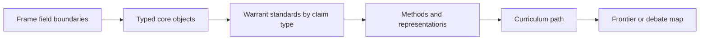
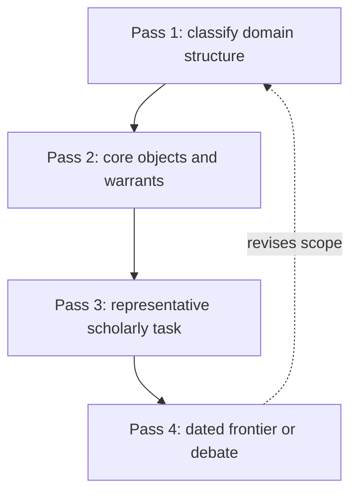

# Structure of Knowledge: solid-state batteries

## Research Frame

| Item | Value |
|---|---|
| Field | solid-state batteries |
| Learner | researcher with undergraduate physical chemistry and materials science who is entering electrochemical energy storage |
| Goal | understand and critically evaluate solid-state battery research across electrolyte chemistry, interfaces, mechanics, characterization, cell engineering, and scale-up |
| Time budget | 10 weeks |
| Domain classification | mixed / classification to verify |
| Profile hypothesis | hybrid profile unresolved: estimate formal, empirical, interpretive, computational, practice, and infrastructure lenses during source review; use the strongest two to four lenses to shape the curriculum. |
| Scaffold stance | Start with a mixed map, then choose whether the field behaves more like a formal prerequisite graph, an ill-structured debate network, an infrastructure pipeline, or a hybrid. |
| Scoped assumption | Treat solid-state batteries as mixed until initial source review identifies the dominant knowledge structure. |
| Evidence posture | Use canonical sources for durable structure and dated sources for frontier claims, standards, tools, datasets, or debates. |

## 1. Domain Decomposition

- Subfields: identify major branches of solid-state batteries and whether each is formal, interpretive, practice-based, empirical, or infrastructure-bound.
- Shared foundations: name concepts, methods, representations, and evidence standards that recur across branches.
- Divergent methods: mark where proof, interpretation, experiment, design, data infrastructure, or institutional review changes the curriculum.
- Boundary assumptions: state what this scaffold includes and what it leaves to an adjacent-field path.
- Candidate scoped path: pick the dominant structure after reviewing orientation sources.

## 2. Orientation

Use this starter to discover the governing structure of solid-state batteries before committing to a single curriculum shape. The first research pass should decide which parts need prerequisite graphs, which need debate or case networks, and which need infrastructure or standards maps.

## 3. The Field's Deep Structure

| Element | In this field | First-pass representation | Deeper synthesis | Why it matters |
|---|---|---|---|---|
| Generative questions | Questions may involve classification, interpretation, design, measurement, explanation, or intervention. | Name the question types by subfield. | Explain which question type organizes the chosen path and which remain secondary. | Prevents an arbitrary one-size-fits-all scaffold. |
| Core objects | Concepts, cases, models, artifacts, datasets, instruments, institutions, or texts depending on subfield. | Build a typed inventory of objects. | Show relations among object types and which sources warrant claims about each. | Mixed fields often fail when object types are blurred. |
| Substantive structure | Core concepts, models, schools, cases, methods, tools, and institutions. | Group content by the structure it uses. | Identify load-bearing concepts that recur across subfields. | Keeps the report relational rather than encyclopedic. |
| Syntactic structure | Proof, interpretation, experiment, validation, critique, design review, or standards compliance. | Pair claim types with warrant types. | Compare how credibility differs across subfields. | The learner must know how each kind of claim is judged. |
| Representations | Concept maps, prerequisite graphs, debate maps, timelines, data pipelines, typologies, or system diagrams. | Choose one representation per major branch. | Integrate them into a single visual package with labeled relations. | The visual form should fit the field rather than dominate it. |
| Methods | Formal, empirical, interpretive, computational, design, or institutional methods. | Attach methods to representative tasks. | Name method limits and transfer conditions. | Method transfer is powerful but risky across boundaries. |
| Evidence standards | Correctness, coherence, explanatory power, reproducibility, external validity, practical effect, or compliance. | List standards by claim type. | Design assessment tasks that require using the right standard. | Mixed domains require evidence pluralism with discipline. |
| Threshold concepts | The first concepts that reorganize how an outsider sees the field's boundaries and warrants. | Identify candidate thresholds during orientation. | Test thresholds against readings and practice artifacts. | Thresholds determine the spiral sequence. |
| Failure modes | Flat topic lists, imported assumptions from one parent field, ignoring access and currentness, or using the wrong warrant standard. | Name likely errors for the learner profile. | Create tasks that reveal and correct the errors. | Mixed fields punish unexamined transfer. |

## 4. Domain Structure Map

Use this mixed map for the first research pass; split it into formal, debate, or infrastructure maps when the dominant structure becomes clear.

## 5. Source Role Probe

Source roles are diagnostic, not quotas. Use this table to decide which evidence roles are necessary for this run, and mark irrelevant roles as waived with a rationale after initial source review.

| Source role | Status | Candidate source pattern | What it tests | Waiver or revision rule |
|---|---|---|---|---|
| Orientation / boundary | Required | Handbook, syllabus cluster, survey, companion, field guide, or expert overview | Tests whether the field is formal, interpretive, empirical, practice-based, infrastructure-bound, or hybrid. | Revise the profile after source review; do not let the initial keyword guess settle the structure. |
| Canonical foundation | Required | Textbook, monograph, seminal paper, standard, primary corpus, canonical case, or foundational dataset | Identifies the load-bearing concepts, objects, examples, and stabilized vocabulary. | Choose foundations that fit the dominant lens rather than forcing a generic textbook model. |
| Method / warrant | Required | Methods source, proof source, empirical protocol, interpretive guide, design rationale, or standards documentation | Shows how the field validates claims and what competent performance looks like. | If warrant styles differ by subfield, preserve the plurality in the output. |
| Pedagogical sequence evidence | Required | Syllabi, lecture notes, course maps, reading lists, training programs, or assessment artifacts | Reveals teachable order, prerequisites, bottlenecks, and recurring fundamental ideas. | Use curricula as evidence of consensus, not as a conservative boundary around the field. |
| Recent survey / frontier | Conditional | Recent review, open-problems source, symposium, roadmap, standards update, or conference tutorial | Needed only when making current, active-debate, tool, standard, or research-entry claims. | Waive with rationale for stable core-skill paths; include for research fluency and frontier participation. |
| Dataset / standard / infrastructure | Conditional | Dataset, software, standard, facility, protocol, benchmark, repository, or governance source | Tests whether material infrastructure mediates the field's knowledge. | Require if the domain is data-, tool-, instrument-, or standard-mediated; otherwise mark waived. |
| Primary corpus / canonical case | Conditional | Primary source corpus, legal case, artifact set, canonical experiment, exemplar proof, or worked system | Tests whether learners need concrete cases to see the field's structure. | Require for interpretive, legal, historical, language, design, and case-based domains. |

## 6. Literature Ladder

| Layer | Source | Type | Identifier | Access route | Budget | Difficulty | Read for | Notes |
|---|---|---|---|---|---:|---:|---|---|
| Orientation | Handbook, syllabus, or survey that names subfields and methods | handbook/syllabus/review | DOI/URL/ISBN | official or library route | $0 or library preferred | 2 | Decide the dominant domain structure | Prefer sources that compare subfields |
| Foundation | Canonical source for the most load-bearing concepts | book/paper/standard | DOI/arXiv/ISBN/URL | official or library route | budget unknown; library preferred | 3 | Anchor durable concepts and vocabulary | Verify whether it is still the right entry point |
| Methods | Source explaining the field's main warrant or practice style | book/paper/notes | DOI/URL/ISBN | official route | $0 or library preferred | 3 | Learn how claims are judged | Pair with representative task |
| Canonical case or example | Case, dataset, proof, artifact, system, or episode experts repeatedly use | case/dataset/paper/book | DOI/URL/ISBN | official route | $0 or library preferred | 3 | Make abstract structure inspectable | Choose one that reveals method and evidence |
| Synthesis | Review or companion that connects branches | review/book | DOI/URL/ISBN | official or library route | $0 or library preferred | 3 | Prevent subfield siloing | Check date and scope |
| Conditional frontier or debate | Recent survey, roadmap, symposium, standard, problem list, or waived role rationale | paper/report/preprint/waiver | DOI/arXiv/URL or rationale | official route, $0, or waived | $0 or library preferred | 4 | Date current priorities only when the goal requires current claims | Waive for stable core-skill paths with rationale |

## 7. Curriculum Roadmap

| Phase | Module | Essential question | Readings | Practice artifact | Progress criteria |
|---|---|---|---|---|---|
| Orientation | Field boundary and domain-type decision | What kind of knowledge structure does this field actually use? | orientation source plus one canonical example | Domain-type memo with scoped path | Can justify the chosen scaffold shape |
| Core grammar | Objects, representations, and warrants | What are the field's objects, and how are claims about them judged? | foundation plus methods sources | Core structure matrix with examples | Can match claim types to evidence standards |
| Research fluency | Representative scholarly performance | What does competent work look like in this domain? | canonical case/example plus synthesis | Reproduction, critique, proof, case, or design artifact | Can perform a partial expert task with explicit assumptions |
| Conditional currentness check | Live problem, debate, standard, infrastructure shift, or explicit waiver | Does this goal require current research, active tools, standards, or frontier participation? | dated frontier source or waiver rationale | Source-role decision memo with currentness audit | Can distinguish durable foundations from current claims, or justify why no frontier source is needed |

## 8. Practice and Assessment

Use a domain-type memo, source role matrix, concept map with labeled relations, representative task artifact, and frontier currentness audit. Assessment should reward choosing the right structure for the field instead of forcing one template.

## 9. Frontier, Debates, and Open Problems

| Problem or debate | Current state | Key sources | Required background | Why it is hard |
|---|---|---|---|---|
| Dominant-structure uncertainty | Initial research should decide whether the frontier is formal, interpretive, infrastructure-bound, or hybrid | orientation sources, recent surveys, field handbooks | field boundaries and warrant standards | The wrong structure will produce the wrong curriculum |
| Cross-subfield translation | Identify concepts or methods that travel poorly across branches | synthesis sources, critiques, methods papers | core object inventory | Transfer can hide incompatible assumptions |
| Currentness-sensitive claim | Track active tools, standards, datasets, debates, or problem lists with absolute dates | recent reports, standards, surveys, preprints | source access and date audit | Mixed fields often change at uneven speeds |

## 10. Visual Summary

Start with a domain-classification spiral, then specialize the map after source review.

## 11. Sources and Further Reading

Source priorities: Prioritize orientation sources that reveal domain type, then add foundations, methods, canonical examples, synthesis, and dated frontier material.

| Source | Date | Type | Identifier | Access route | Budget | Layer | Why it matters | Confidence |
|---|---:|---|---|---|---:|---|---|---|
| solid-state batteries orientation source to verify | date after lookup | handbook/syllabus/notes | official URL/ISBN/DOI | open, publisher, or library route | $0 or library preferred | orientation | Establishes the field boundary and learner-facing advance organizer | medium until verified |
| solid-state batteries foundation or corpus source to verify | date after lookup | book/paper/standard/corpus/case | DOI/arXiv/ISBN/URL/catalog ID | official route with access status | budget unknown; library preferred | foundation | Anchors the durable concepts, methods, objects, cases, or corpora of the field | medium until verified |
| solid-state batteries method or warrant source to verify | date after lookup | methods text/problem source/protocol/standard | DOI/arXiv/ISBN/URL | official route with access status | $0 or library preferred | method | Shows how claims, interpretations, proofs, measurements, or performances are judged | medium until verified |
| solid-state batteries conditional source-role check | date after lookup or waived | recent survey/report/preprint/dataset/standard/primary corpus | official route or waiver rationale | $0, license terms, or library preferred | conditional | Verifies only the frontier, dataset, standard, infrastructure, corpus, or case roles needed for this goal | low until role is confirmed |

## 12. Scaffold Quality Notes

- This starter follows the harness gates: domain fit, source access metadata, pedagogical ladder, and not-a-topic-list.
- Treat existing curricula as evidence of stabilized pedagogical consensus, not as the boundary of the field.
- Replace starter source rows with researched citations before treating the report as authoritative.
- Mixed-field audit: the final report should explicitly justify the chosen domain structure and avoid importing the wrong evidence standard from an adjacent field.
