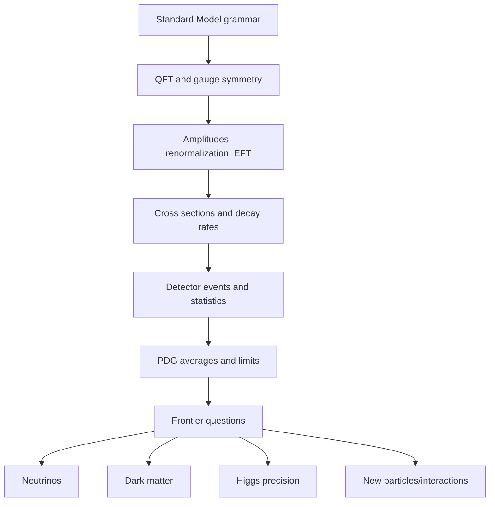

# SoK v0 Sample: Particle Physics

Date: 2026-06-19
Status: Trial output for evaluating the SoK harness, not a complete curriculum.

## 1. Research Frame

| Item | Value |
|---|---|
| Field | Particle physics |
| Target learner | Physics-adjacent scholar with calculus, linear algebra, classical mechanics, and basic quantum mechanics |
| Goal | Build field-entry to research-fluent understanding of the Standard Model, experimental inference, and frontier questions |
| Domain type | Mixed: formal-theoretical, empirical-experimental, infrastructure-bound, and institutionally coordinated |
| Scope assumption | Standard Model and collider/neutrino/frontier context, not full mathematical QFT or detector engineering |

## 2. Deep Structure

Particle physics studies fundamental constituents and interactions through a dual grammar: quantum field theory and experimental event inference. A scholar must learn both the symbolic structure of fields/symmetries and the institutional structure of detectors, collaborations, datasets, and global averages.

| Element | SoK extraction |
|---|---|
| Generative questions | What are the fundamental degrees of freedom? Which symmetries constrain interactions? How do fields produce observable particles/events? Where does the Standard Model fail or remain incomplete? |
| Core objects | Quantum fields, particles as excitations/representations, gauge groups, Lagrangians, amplitudes, cross sections, decay rates, detector events, likelihoods |
| Substantive structure | Standard Model particle content, SU(3)xSU(2)xU(1), electroweak symmetry breaking, QCD, flavor, neutrino oscillation, Higgs physics, effective field theories |
| Syntactic structure | Perturbative calculation, renormalization, symmetry arguments, Feynman rules, statistical significance, detector calibration, global fits, PDG averages, exclusion limits |
| Representations | Feynman diagrams, Lagrangian terms, group representations, event displays, invariant mass peaks, likelihood plots, exclusion contours |
| Threshold concepts | Fields before particles, gauge redundancy, renormalization as scale-dependence, cross section vs branching ratio, luminosity, missing transverse energy, EFT reasoning |
| Failure modes | Learning particle names without dynamics; treating diagrams as pictures rather than terms in an expansion; ignoring detector and statistics layers; reading beyond-Standard-Model claims without limits and confidence |

## 3. Literature Ladder with Access Metadata

| Layer | Source | Type | Identifier | Access route | Budget | Read for |
|---|---|---|---|---|---:|---|
| Orientation | CERN, `The Standard Model` | Official web explainer | URL | Free CERN page | $0 | Initial map of matter, forces, Higgs, and incompleteness |
| Data reference | Particle Data Group, `Review of Particle Physics` | Review/database | PDG 2026 page; 2024 PhysRevD DOI 10.1103/PhysRevD.110.030001 | Free online PDG; APS page for journal version | $0 | Particle properties, reviews, limits, global summaries |
| Field entry | Griffiths, `Introduction to Elementary Particles`, 2nd revised ed. | Book | ISBN 978-3-527-40601-2 | Wiley/library/bookstore | Paid; Wiley ebook search result showed $69, library preferred | Particle phenomenology before full QFT |
| QFT bridge | Tong, `Quantum Field Theory` lecture notes | Open notes | URL/PDF | Free Cambridge/DAMTP notes | $0 | First-pass QFT grammar at master's level |
| Graduate QFT | Peskin and Schroeder, `An Introduction to Quantum Field Theory` | Book | ISBN 9780813350196 student economy ed.; 9780201503975 hardcover | Publisher/library/bookstore | Paid; budget unknown, library preferred | Renormalization, QED, gauge theories, Standard Model bridge |
| Course infrastructure | CERN Summer Student Lecture Programme 2025 | Open lectures/materials | Indico URL | Free lecture timetable/materials where posted | $0 | How the field teaches concepts, statistics, accelerators, and BSM topics |
| Frontier synthesis | Snowmass 2021 summary chapter | Community report/preprint | arXiv:2301.06581 | Free arXiv | $0 | Community-level map of scientific questions and facilities |
| Strategic frontier | 2023 P5 Report, `Pathways to Innovation and Discovery in Particle Physics` | Strategic report | Official P5 site/PDF | Free official report | $0 | Decade-scale priorities: quantum realm, invisible universe, new paradigms |
| BSM topic example | Safdi, `TASI Lectures on the Particle Physics and Astrophysics of Dark Matter` | Lecture notes/preprint | arXiv:2303.02169 | Free arXiv | $0 | A frontier topic with theory, astrophysics, and experiment |

## 4. Curriculum Roadmap

| Phase | Module | Essential question | Practice artifact |
|---|---|---|---|
| Orientation | Standard Model as a constrained grammar | What does the Standard Model explain, and what does it leave out? | One-page map of particles, interactions, and known incompletenesses |
| Core grammar | Relativistic quantum mechanics to fields | Why are particles not the primitive objects? | Derive field-mode interpretation for a simple scalar field |
| Calculation grammar | Feynman rules and amplitudes | How do diagrams become predictions? | Compute or annotate a tree-level scattering amplitude |
| Empirical grammar | Detectors, events, and statistics | How does an event become evidence? | Explain an invariant-mass peak and a confidence/exclusion plot |
| Synthesis | PDG as knowledge infrastructure | How does the field stabilize facts across experiments? | Trace one particle property from experiment to PDG average |
| Frontier | BSM, neutrinos, dark matter, Higgs precision | Where are the cracks and search strategies? | Frontier memo comparing one collider, one neutrino, and one cosmic probe |
| Research fluency | Community planning and feasibility | How do theory, experiment, technology, and budget co-determine research? | P5/Snowmass reading memo: science driver plus facility logic |

## 5. Visual Summary

## 6. Frontier and Debate Map

| Area | Current or frontier issue | Why it matters |
|---|---|---|
| Standard Model limits | CERN notes that the Standard Model omits gravity and leaves questions such as dark matter and matter-antimatter asymmetry unresolved | Defines why the field is not "finished" despite precision success |
| Community planning | Snowmass 2021 and P5 2023 organize priorities across science drivers, facilities, and budgets | Particle physics is infrastructure-bound; research curriculum must include strategy documents |
| Dark matter | TASI lecture notes and P5 place dark matter among central frontier drivers | Requires connecting particle theory, cosmology, astrophysics, and experiment |
| Neutrinos | Neutrino mass and oscillation motivate physics beyond the minimal Standard Model | A threshold case where empirical facts force theoretical extension |

## 7. SoK Usefulness Notes

The SoK frame helped because particle physics cannot be taught as theory alone. The framework exposed a missing layer: infrastructure and institutions are part of the field's syntactic structure. PDG, CERN, Snowmass, P5, detectors, collaborations, and statistical conventions all mediate what counts as knowledge. The v0 skill should therefore explicitly handle infrastructure-bound sciences.

## 8. Source Pointers

- CERN Standard Model page: https://home.cern/science/physics/standard-model/
- Particle Data Group: https://pdg.lbl.gov/
- Griffiths, Wiley page/search result: https://www.wiley.com/en-us/introduction-to-elementary-particles-2nd-revised-edition-p-9783527406012
- Tong QFT notes: https://www.damtp.cam.ac.uk/user/tong/qft.htm
- Peskin and Schroeder Google Books: https://books.google.com/books/about/An_Introduction_To_Quantum_Field_Theory.html?id=hBm3jgEACAAJ
- CERN Summer Student Lecture Programme 2025: https://indico.cern.ch/event/1508891/timetable/
- Snowmass 2021 summary: https://arxiv.org/abs/2301.06581
- 2023 P5 Report: https://www.usparticlephysics.org/2023-p5-report/
- TASI dark matter lectures: https://arxiv.org/abs/2303.02169
