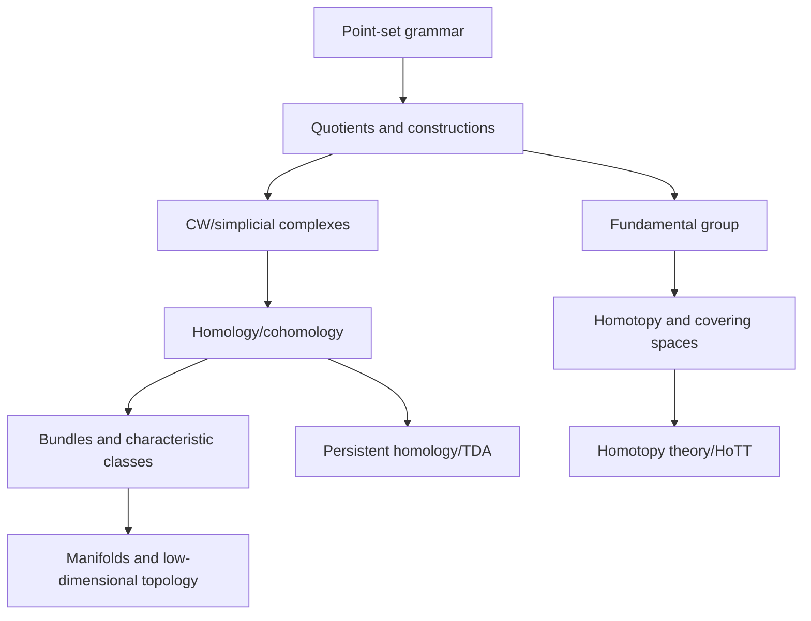

# SoK v0 Sample: Topology

Date: 2026-06-19
Status: Trial output for evaluating the SoK harness, not a complete curriculum.

## 1. Research Frame

| Item | Value |
|---|---|
| Field | Topology |
| Target learner | Mathematically mature scholar new to topology |
| Goal | Build field-entry to research-fluent understanding |
| Domain type | Well-structured formal domain with several divergent subfields |
| Scope assumption | Start with point-set topology and algebraic topology, then branch to manifolds, low-dimensional topology, homotopy type theory, and topological data analysis |

## 2. Deep Structure

Topology studies properties of spaces and maps that remain stable under continuous deformation. Its deep structure is not "rubber-sheet geometry" but the discipline of replacing fragile geometric detail with invariant information.

| Element | SoK extraction |
|---|---|
| Generative questions | When are two spaces the same for a chosen notion of sameness? What properties survive continuous deformation? Which invariants distinguish spaces, and where do they fail? How can local information determine global structure? |
| Core objects | Topological spaces, continuous maps, quotient spaces, manifolds, complexes, fiber bundles, spectra, persistence modules |
| Substantive structure | Open sets, continuity, compactness, connectedness, separation, quotient constructions, homotopy, fundamental group, covering spaces, homology, cohomology, characteristic classes |
| Syntactic structure | Proof by construction and counterexample, invariance arguments, functoriality, exact sequences, universal properties, classification theorems, obstruction arguments |
| Representations | Diagrams of spaces and maps, commutative diagrams, CW complexes, simplicial complexes, chain complexes, long exact sequences, barcodes |
| Threshold concepts | Quotient topology, functoriality, homotopy invariance, exactness, local-to-global reasoning, "same up to equivalence" rather than equality |
| Failure modes | Treating topology as visual intuition only; confusing metric and topological properties; using invariants as if they were complete; skipping quotient examples; reading homology as computation rather than functorial structure |

## 3. Literature Ladder with Access Metadata

| Layer | Source | Type | Identifier | Access route | Budget | Read for |
|---|---|---|---|---|---:|---|
| Orientation | Hatcher, `A List of Recommended Books in Topology` | Open notes/list | URL | Free PDF from Cornell | $0 | Meta-map of topology subareas and book choices |
| Core point-set | Munkres, `Topology`, 2nd/reissue ed. | Book | ISBN 978-0-13-468951-7 | Pearson/library/used book search | Paid; seen roughly $90-$240 in used-book search results, library preferred | Standard point-set grammar and bridge to algebraic topology |
| Core algebraic | Hatcher, `Algebraic Topology` | Book/open PDF | Cambridge UP 2002; free author PDF | Free official PDF from Cornell | $0 | Fundamental group, covering spaces, homology, cohomology |
| Graduate syllabus check | FSU Graduate Topology 2024/2025 page | Open syllabus | URL | Free web page | $0 | Real course sequencing around Hatcher and homology/cohomology |
| Alternative algebraic viewpoint | May, `A Concise Course in Algebraic Topology` | Book | Chicago UP 1999 | Purchase/library | Budget unknown; library preferred | Big-picture categorical compression after first pass |
| Differential bridge | Bott and Tu, `Differential Forms in Algebraic Topology` | Book | Springer GTM 82 | Purchase/library | Budget unknown; library preferred | De Rham perspective, spectral sequences, geometry-to-topology bridge |
| Frontier/formal foundations | `Homotopy Type Theory: Univalent Foundations of Mathematics` | Book/open PDF | arXiv:1308.0729; HoTT Book | Free official PDF/site | $0 | Homotopy-theoretic foundations and univalence |
| Frontier/applied | Otter et al., `A roadmap for the computation of persistent homology` | Paper/open article | DOI 10.1140/epjds/s13688-017-0109-5 | Open Springer article | $0 | Computational TDA pipeline, algorithms, software benchmarks |
| Frontier/low-dimensional | Kirby problem list lineage and newer low-dimensional problem agenda | Problem-list tradition/secondary report | K2 PDF and Quanta overview | Open web/PDF where available | $0 | How topology organizes open problems and prestige in low-dimensional work |

## 4. Curriculum Roadmap

| Phase | Module | Essential question | Practice artifact |
|---|---|---|---|
| Orientation | Spaces, maps, invariants | What does topology ignore, and what does it preserve? | Compare metric, smooth, and topological equivalence for five examples |
| Core grammar | Point-set topology | Which hypotheses make continuous reasoning possible? | Counterexample notebook: compactness, Hausdorffness, quotient pathologies |
| First synthesis | Fundamental group and covering spaces | How do loops encode global shape? | Compute pi_1 for graphs, circles, tori, projective plane sketches |
| Algebraic machinery | Homology/cohomology | How do chain complexes turn spaces into computable invariants? | Compute cellular homology of standard CW complexes |
| Structural fluency | Functoriality and exact sequences | Why are maps between spaces as important as spaces? | Build a long exact sequence explanation for a pair |
| Branching | Manifolds, bundles, K-theory, HoTT, TDA | Which subfield changes the object language? | Produce a subfield choice memo with prerequisite map |
| Frontier participation | Problem culture | How are open problems formulated and evaluated? | Annotated problem list: one approachable, one impossible, one method-driven |

## 5. Visual Summary

## 6. Frontier and Debate Map

| Area | Current or frontier issue | Why it matters |
|---|---|---|
| Low-dimensional topology | Problem-list culture around knots, surfaces, 3- and 4-manifolds | Shows topology as a living problem economy, not only a completed textbook sequence |
| Homotopy type theory | Univalence and higher inductive types as a foundation with homotopical content | Rewrites the relation between topology, logic, and formalization |
| Topological data analysis | Persistent homology algorithms and robustness for high-dimensional/noisy data | Tests whether topological invariants can become practical data-analysis tools |

## 7. SoK Usefulness Notes

The SoK frame helped because topology is too broad for a flat reading list. The substantive/syntactic split made the curriculum focus on invariance, construction, functoriality, and proof culture. The main weakness is that "topology" must be decomposed early; otherwise the curriculum risks mixing point-set prerequisites, algebraic topology, geometric topology, and applied topology without a clear research goal.

## 8. Source Pointers

- Hatcher, `Algebraic Topology`: https://pi.math.cornell.edu/~hatcher/AT/ATpage.html
- Hatcher, recommended topology books: https://pi.math.cornell.edu/~hatcher/Other/topologybooks.pdf
- Munkres bibliographic entry: https://bibbase.org/network/publication/munkres-topology-2018
- FSU graduate topology page: https://www.math.fsu.edu/~banerjee/topologyfall2024.html
- HoTT Book: https://homotopytypetheory.org/book/
- Otter et al. persistent homology roadmap: https://link.springer.com/article/10.1140/epjds/s13688-017-0109-5
- Quanta overview of low-dimensional topology problem lists: https://www.quantamagazine.org/a-new-agenda-for-low-dimensional-topology-20240222/
