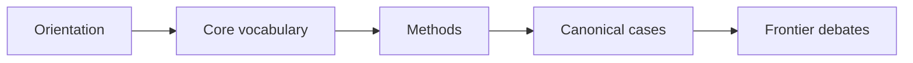
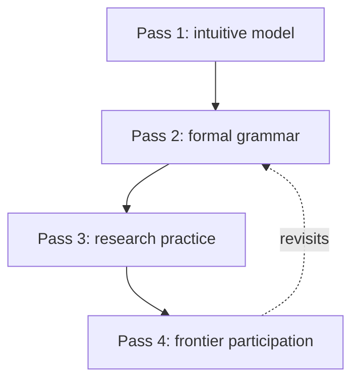
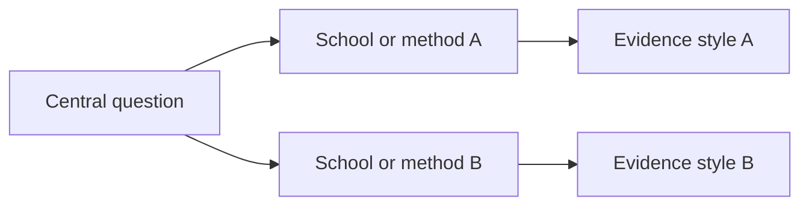

# SoK Output Contract

## Required Package for Substantial Tasks

A full SoK answer should contain:

1. Executive orientation: what the field is, why it matters, and what kind of scholarly path this report builds.
2. Preliminary domain profile: the candidate formal, interpretive, empirical, computational, professional, infrastructure-bound, emerging, interdisciplinary, or mixed lenses to verify through source review.
3. Structure of knowledge: core questions, objects, representations, methods, evidence standards, and threshold concepts.
4. Source role probe: role-based evidence requirements, including required, conditional, optional, and waived roles with rationale.
5. Literature stack: entry points, foundational works, core textbooks or monographs, primary corpora or cases, methods sources, survey/frontier readings, standards, datasets, or infrastructure sources as appropriate.
6. Curriculum roadmap: field-newcomer to research-fluent sequence with modules, objectives, readings, practice tasks, and outputs.
7. Frontier and debates: current problems, unresolved tensions, major schools, and research opportunities when the goal requires them.
8. Visual package: graph views selected from structured concepts, claims, sources, curriculum steps, frontier/debate items, and relations when useful.
9. Quality notes: assumptions, source limits, waived source-role rationale, and what should be verified next.

For delegated agent work, also produce an agent packet when useful: `agent-brief.md`, `tasks.md`, `sources.csv`, `report.md`, `downloads/`, `notes/`, and `logs/`. Use `cargo run --bin sok -- init` from the skill folder to generate these files.

Keep agent scaffolds and human-reader reports separate. Scaffolds may expose learner profile, original goal, assumptions, placeholders, and quality-gate notes. Human-reader reports should hide that machinery, surface only interpretation-relevant scope notes, and replace scaffold placeholders with researched sources or remove them. Use `sok scaffold` for the first artifact and `sok handoff-report` when passing the scaffold to a next agent for report completion.

For tool-facing output, `sok-report.json` is the structured source of truth. Markdown scaffolds and canonical Markdown reports are bounded inputs to `sok export-json`; HTML is a rendered public view of validated `human_report` JSON. `internal_context` and `diagnostics` are never public report content.

## Recommended Section Template

Use this shape unless the user requested a different format:

```markdown
# Structure of Knowledge: [Field]

## 1. Orientation
## 2. The Field's Deep Structure
## 3. Concept and Prerequisite Map
## 4. Source Role Probe
## 5. Literature Ladder
## 6. Curriculum Roadmap
## 7. Practice and Assessment
## 8. Frontier, Debates, and Open Problems
## 9. Visual Summary
## 10. Sources and Further Reading
```

The CLI scaffold should keep this section shape while specializing the starter content to the inferred domain structure. Formal fields should foreground prerequisite/proof graphs and counterexample practice; ill-structured fields should foreground cases, schools, lenses, and debate maps; infrastructure-bound fields should foreground instruments, datasets, collaborations, standards, uncertainty practices, and strategic reports.

The inferred structure is provisional. Use source review to revise it into a profile of the strongest lenses, not a single restrictive category. Existing university curricula, syllabi, and course maps are evidence of stabilized pedagogical consensus; they must not define the boundary of the field by themselves.

## Tables

Core structure matrix:

| Element | In this field | First-pass representation | Deeper synthesis | Why it matters |
|---|---|---|---|---|

Literature ladder:

| Layer | Source | Type | Access route | Budget | Difficulty | Read for | Skip/skim notes |
|---|---|---|---|---:|---:|---|---|

Source role probe:

| Source role | Status | Candidate source pattern | What it tests | Waiver or revision rule |
|---|---|---|---|---|

Curriculum roadmap:

| Phase | Module | Essential question | Readings | Practice artifact | Progress criteria |
|---|---|---|---|---|---|

Frontier map:

| Problem or debate | Current state | Key sources | Required background | Why it is hard |
|---|---|---|---|---|

## Structured Visual Views

Use `visual_views` only when structured relations justify a view. Supported view kinds include knowledge-spine, concept-source, dependency-path, and frontier/debate views. Each view should name its purpose, nodes, edges, and relation-backed justification. Mermaid is not required; it can still be used as a drafting aid in Markdown, but JSON relations are the durable contract.

Prerequisite graph concept:



Spiral curriculum:



Debate map:



When rendering HTML, the renderer should instantiate only declared `visual_views` that have enough nodes and edges. A report with no justified graph must remain complete and readable without an empty visualization shell.

## Tone and Depth

- Write for a scholar entering the field, not for a general audience.
- Preserve technical terms, formal distinctions, and hard concepts. Introduce them through examples and relations, but do not soften them into popular explanation.
- Mark difficulty honestly. Do not pretend foundational texts are always good first reads.
- Prefer a useful curriculum over encyclopedic completeness.

## Access Metadata

Every recommended source should be actionable:

- For a book, say `Book`, give publisher or ISBN when available, and suggest library, used copy, ebook, or purchase route.
- For a paper, say `Paper`, give DOI, arXiv ID, stable URL, or venue metadata.
- For lecture notes or open course materials, say `Open notes/course` and give the direct URL.
- For standards, datasets, or software, say `Standard`, `Dataset`, or `Software` and give the official access route.
- If a source is paywalled, subscription-only, or paid, provide an estimated budget when visible. If the price is not visible, write `budget unknown; prefer institutional library or interlibrary loan`.
- Do not recommend an inaccessible source without explaining how to find an accessible substitute.

## Minimal Answer Variant

For small requests, return:

- A short structure map.
- Five to ten key readings grouped by purpose.
- A three-stage scholarly learning path.
- One note about current frontier or debate.

## Agent Artifact Variants

For textbook requests, include:

- Textbook thesis and reader model.
- Chapter architecture with dependency logic.
- Exercise ladder, worked examples plan, and assessment philosophy.
- Citation, permissions, and source-access plan.

For model-tuning or domain-corpus requests, include:

- Legally usable corpus plan.
- License/access audit.
- Exclusion list for paywalled, paid, subscription, and license-unclear materials.
- Evaluation set blueprint and contamination controls.

For delegated research requests, include:

- Agent brief.
- Source manifest.
- Download log for open/free/user-provided materials.
- Quality-gate checklist.
