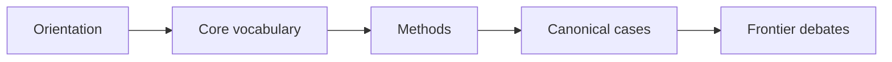
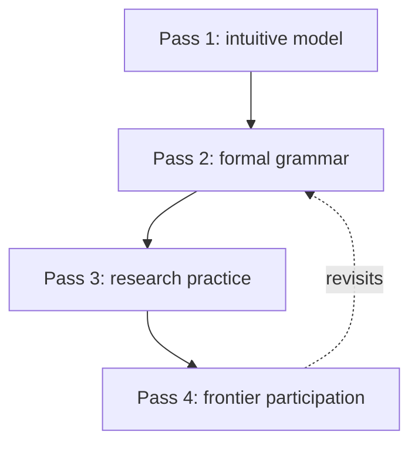
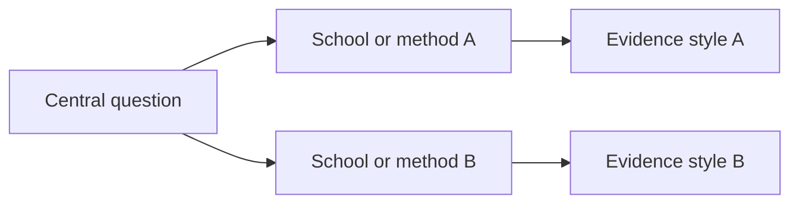

# SoK Output Contract

## Semantic Obligations for Substantial Tasks

A full SoK run must establish these findings before it chooses a public report shape:

1. The field boundary, reader goal, and a provisional domain profile that source review may revise.
2. The field-native elements that carry knowledge in this run: questions, objects, cases, representations, methods, warrants, institutions, instruments, datasets, practices, disputes, or other observed forms.
3. The few load-bearing relations that make those elements cohere, including which ideas are core and which surrounding elements are necessary for understanding them.
4. A role-based evidence plan with required, conditional, and waived source roles plus rationale.
5. A comparison of plausible organizing forms and an explicit report-architecture decision.
6. Claims, sources, currentness limits, and verification notes sufficient for the artifact being produced.

Literature ladders, curricula, frontier maps, visual views, and practice plans are capability modules. Include them when they serve the user goal or the chosen architecture; do not turn them into mandatory public chapters.

For delegated agent work, also produce an agent packet when useful: `agent-brief.md`, `tasks.md`, `sources.csv`, `report.md`, `downloads/`, `notes/`, and `logs/`. Use `${CODEX_HOME:-$HOME/.codex}/skills/structure-of-knowledge/bin/sok init` from an installed skill, or run `cargo run --locked --manifest-path cli/Cargo.toml --bin sok -- init` from a repository checkout.

Keep agent scaffolds and human-reader reports separate. Scaffolds may expose learner profile, original goal, candidate lenses, assumptions, placeholders, rejected organizing forms, and quality-gate notes. Human-reader reports should hide that machinery, surface only interpretation-relevant scope notes, and replace scaffold placeholders with researched sources or remove them. Use `sok scaffold` for the discovery canvas and `sok handoff-report` when passing it to a next agent for report completion.

For tool-facing output, `sok-report.json` is the structured compatibility projection. Markdown scaffolds and human reports remain the human authoring and compatibility import lane for `sok export-json`; HTML is a rendered public view of validated `human_report` JSON. `internal_context` and `diagnostics` are never public report content.

When reproducibility metadata is needed, artifact-producing commands may also write a private `sok-run/v1` sidecar with `--run-manifest <sok-run.json>`. The run manifest records command metadata, declared permissions, bounded input file hashes, output file hashes, optional executor metadata, and a timestamp-independent semantic digest. Treat it as disposable private run metadata; do not embed run manifests, executor details, or private paths in `sok-report.json` or rendered HTML.

Machine input is opt-in. `sok export-json` may also read typed core sidecars with `--knowledge <sok-knowledge.json>`, `--evidence-package <sok-evidence.json>`, and `--pedagogy <sok-pedagogy.json>`, or typed fenced blocks in the Markdown:

````markdown
```sok-json sok-knowledge/v1
{
  "schema_version": "sok-knowledge/v1",
  "elements": []
}
```
````

Typed machine inputs feed directly into the `sok-knowledge/v1`, `sok-evidence/v1`, and `sok-pedagogy/v1` core validators. They do not depend on localized Markdown table headers. Markdown tables, `sok:surface` markers, and narrative prose remain supported for human-authored inputs. When human and machine lanes provide different values for the same stable ID or package field, the exporter keeps the first value deterministically and emits an `export.machine-input` diagnostic instead of overwriting silently.

## Compatibility, Migration, and Rollback

Public `sok-report/v1` and `sok-report/v2` remain readable. New final human-report exports use `sok-report/v2`; unknown report, core, run, and work schema versions must be rejected by validators rather than guessed.

ASCII stable IDs remain stable. Existing non-ASCII IDs do not need an automatic rewrite; use `sok migrate-ids --input <sok-report.json> --output <id-map.json>` when an explicit, reviewable old-to-new map is needed. Reference rewriting is a separate deliberate step outside the command.

Core packages, run manifests, and work protocol files are additive sidecars. `sok-knowledge/v1`, `sok-evidence/v1`, and `sok-pedagogy/v1` can be supplied to `export-json` or omitted. `sok-run/v1`, `sok-work-order/v1`, and `sok-work-result/v1` are private files for reproducibility and bounded exchange; removing them rolls the workflow back to Markdown/source/evidence inputs without changing public report payloads.

For bounded collaboration, a WorkOrder declares the current SoK task kind, required capabilities, allowed core patch paths, and a default-deny permission envelope. A WorkResult returns a typed refusal, degradation plan, or proposed patches against core packages. Accepting a result writes a new validated core output file and never mutates source inputs in place.

## Field-First Report Composition

Do not select the table of contents from a universal template or from the field name alone.

1. Review boundary, foundation, and method sources.
2. Build the field-element inventory and identify load-bearing relations.
3. Compare at least two organizing forms against those findings and the reader's task.
4. Select the executive thesis, core ideas, important surrounding elements, narrative sequence, and visual logic.
5. Record the decision in a `## Report Architecture` key/value table.
6. Write ordered, field-specific `##` narrative sections.
7. Add machine-verifiable surfaces only where needed.

The architecture table requires `Executive thesis`, `Chosen organizing form`, `Architecture rationale`, and `Rejected alternatives and why`. The last field preserves evidence that at least one plausible competing form was considered rather than allowing the chosen form to be asserted without comparison. The exporter preserves every public H2 in order under `report.presentation.sections`; arbitrary headings are not discarded. The HTML renderer follows that order and keeps validation data in a separate collapsed evidence appendix.

All four architecture decisions, a complete field-element inventory with core and surrounding/context roles, and at least one public narrative section are required for new final-Markdown exports. New exports use `sok-report/v2`, where human reports require both `presentation` and `field_elements`; v1 keeps them optional only for legacy artifacts.

Use `<!-- sok:purpose ... -->` to attach a concise section purpose and `<!-- sok:visual-view view-id -->` to place a declared visual view inside a narrative section.

Structured surfaces may retain canonical headings or use a field-specific heading followed by one marker:

```markdown
<!-- sok:surface report-architecture -->
<!-- sok:surface field-elements -->
<!-- sok:surface literature-ladder -->
<!-- sok:surface relations -->
<!-- sok:surface curriculum -->
<!-- sok:surface visual-views -->
<!-- sok:surface claims -->
```

Canonical headings remain supported for compatibility. Markers decouple machine extraction from the public title.

Directives must be recognized, non-empty, and written as standalone lines outside fenced code; surface markers must also be unique within a section. Unknown, empty, or duplicate controls are blocking diagnostics rather than silent data loss.

## Machine-Facing Tables

Field-element inventory:

| Element class | Observed element | Actual form in this field | Role | Load-bearing relations | Source IDs | Confidence |
|---|---|---|---|---|---|---|

The exporter preserves these rows in `report.field_elements` before deriving the legacy `core_ideas`, `methods`, and `representations` compatibility views. Use `field_element` relation endpoints when a case, instrument, institution, dataset, practice, dispute, or other field-native class should remain addressable without being renamed as a concept.

Structured literature ladder:

| Layer | Start here | Read for | Do not infer | Source IDs | Notes |
|---|---|---|---|---|---|

Source role probe:

| Source role | Status | Candidate source pattern | What it tests | Waiver or revision rule |
|---|---|---|---|---|

Structured curriculum roadmap:

| Phase | Module | Essential question | Readings | Practice artifact | Progress criteria | Prerequisite IDs |
|---|---|---|---|---|---|---|

Frontier map:

| Problem or debate | Current state | Key sources | Required background | Why it is hard |
|---|---|---|---|---|

Structured relations:

| Relation ID | Relation kind | From type | From reference | To type | To reference | Rationale | Source IDs |
|---|---|---|---|---|---|---|---|

Structured visual views:

| View ID | View kind | Title | Purpose | Relation IDs | Node emphasis |
|---|---|---|---|---|---|

Structured claims:

| Statement | Claim type | Evidence requirement | Source IDs | Confidence | Temporal status | Notes |
|---|---|---|---|---|---|---|

`Source IDs`, relation endpoints, prerequisite references, and visual node emphasis may use stable JSON IDs or unambiguous source titles / row labels from the bounded Markdown and manifest. Ambiguous or unresolved references must become diagnostics, not silent guesses. Valid relation endpoint types are `field_element`, `concept`, `method`, `representation`, `claim`, `source`, `curriculum_step`, and `frontier_debate`. Canonical relation kinds are `requires_before`, `introduced_by`, `revisits`, `deepens`, `applies`, `assessed_by`, and `remediates`. Legacy labels such as `depends_on`, `supports`, `qualifies`, `contradicts`, `precedes`, `introduces`, `uses_method`, `represented_by`, `grounds`, `motivates`, `part_of`, and `maps_to` are accepted only through explicit compatibility mapping.

## Structured Visual Views

Use `visual_views` only when structured relations justify a view. Supported view kinds include knowledge-spine, concept-source, dependency-path, and frontier/debate views. Each view should name its purpose, nodes, edges, and relation-backed justification. Mermaid is not required; it can still be used as a drafting aid in Markdown, but JSON relations are the durable contract.

Prerequisite graph concept:



Spiral curriculum:



Debate map:



When rendering HTML, the renderer should instantiate only declared `visual_views` that have enough nodes and edges. A report with no justified graph must remain complete and readable without an empty visualization shell.

## Strict Final Validation

Before publication, final reports should pass `sok lint --stage final`, `sok export-json --stage final`, `sok validate-report --strict`, and then `sok render-html`. Strict validation treats embedded export warnings as blocking unless an accepted-loss waiver is explicit. Substantial final reports need preserved load-bearing relations. A multi-step curriculum needs at least one prerequisite, and declared visual intent needs relation-backed visual views; intentional omissions require `structure_waivers`.

Claim support is semantic. `support_kind: supports` can satisfy an affirmative claim when the evidence is `reviewed` or `verified` and includes `reviewed_at` plus a locator or support note. `qualifies` narrows or contextualizes an already supported claim, `contradicts` records conflict or confidence limits, and `background` / `example` remain visible but non-supporting. `cataloged` evidence from source ingestion never satisfies claim support by itself.

## Tone and Depth

- Write for a scholar entering the field, not for a general audience.
- Preserve technical terms, formal distinctions, and hard concepts. Introduce them through examples and relations, but do not soften them into popular explanation.
- Mark difficulty honestly. Do not pretend foundational texts are always good first reads.
- When the goal requires a curriculum, prefer a useful path over encyclopedic completeness.

## Access Metadata

Every recommended source should be actionable:

- For a book, say `Book`, give publisher or ISBN when available, and suggest library, used copy, ebook, or purchase route.
- For a paper, say `Paper`, give DOI, arXiv ID, stable URL, or venue metadata.
- For lecture notes or open course materials, say `Open notes/course` and give the direct URL.
- For standards, datasets, or software, say `Standard`, `Dataset`, or `Software` and give the official access route.
- If a source is paywalled, subscription-only, or paid, provide an estimated budget when visible. If the price is not visible, write `budget unknown; prefer institutional library or interlibrary loan`.
- Do not recommend an inaccessible source without explaining how to find an accessible substitute.

## Minimal Answer Variant

For small requests, return only what serves the request:

- A short structure map.
- A few source pointers grouped by purpose when the user needs readings or verification.
- A compact next-step path when the user asks how to learn or act.
- A dated frontier or debate note only when currentness matters.

## Agent Artifact Variants

For textbook requests, include:

- Textbook thesis and reader model.
- Chapter architecture with dependency logic.
- Exercise ladder, worked examples plan, and assessment philosophy.
- Citation, permissions, and source-access plan.

For model-tuning or domain-corpus requests, include:

- Legally usable corpus plan.
- License/access audit.
- Exclusion list for paywalled, paid, subscription, and license-unclear materials.
- Evaluation set blueprint and contamination controls.

For delegated research requests, include:

- Agent brief.
- Source manifest.
- Download log for open/free/user-provided materials.
- Quality-gate checklist.
